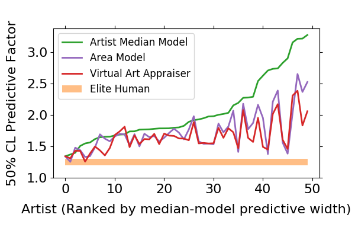
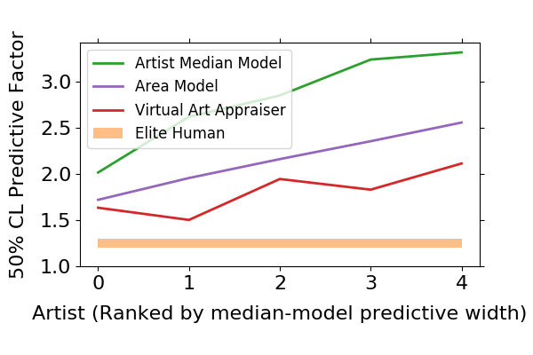

# Virtual Art Appraiser Code/Analysis Samples

## Intro

This repository contains some of the backend code used to build the [Virtual Art Appraiser](https://virtual-appraiser.herokuapp.com/) app's pilot version, as well as some illustrative analysis results. For more background, see [here](https://virtual-appraiser.herokuapp.com/about).

The app works off of a custom database of historical auctions of 19th-Century European paintings scraped from the websites of the Sotheby's auction houses. For a small sample of well-known artists, we also include aggregated global auction sales compiled from ArtNet.

Each painting in the database carries an appraised value, determined by an elite human appraiser. The app attempts to learn how basic features of a painting, such who painted it and its overall dimensions, correlate with its appraised value. (Upcoming versions will exploit features contained in the composition of the image itself, with the aid of Google Vision.) Based on this virtual "apprenticeship," it can then formulate its own appraisals for newly-presented paintings.

The machine learning stage ([trainVirtualAppraiser.py](trainVirtualAppraiser.py)) employs models such as polynomial-feature linear regression and random forests. An appropriate model and hyperparameters for each artist are determined using a cross-validation scan. In cases where a given feature may not be reliably available, such as the date that a painting was created, sequences of different models may be created that allow the Virtual Art Appraiser to adapt to the available information.

An important feature of the modeling approach is that, much like an honest human appraiser, the Virtual Art Appraiser reports its own uncertainty. It does so using a kind of hybrid of bootstrapping and cross-validation (see [predictiveIntervalRegressor.py](predictiveIntervalRegressor.py)). If it has an easy job finding a pattern in the historical record, it will report a narrow appraisal range. If a clear pattern turns out to be more elusive, the reported range will be broadened accordingly.

For most of the artists that it is trained on, the Virtual Art Appraiser can currently predict the value of a painting to within a factor of about 1.7 up or down, at a confidence level of 50%. However, some artists can be appraised to a factor of 1.3 or better, whereas others are still worse than a factor of 2. The typical equivalent 50% confidence range for an elite human appraiser is about 1.3 (based on our own analysis of appraisal prices versus sale prices). Not bad for a newly-trained, and *blind*, automated appraiser!

## Performance Summary

In a bit more detail, we can look at the average appraisal precision on the 50 best-represented artists in the database, for a sequence of different modelings. Each artist typically has O(30--40) paintings in the database on which to train, though artists from the ArtNet database each have hundreds. (In the case of Corot, the highest sales-volume artist, there are over 1,000.)

The simplest model considered is to take the median value of all past appraisals, and to form appraisal intervals based on the spread around that median. We rank our artists based on the fractional width of those median-model intervals, to give a baseline of how "difficult" they are to appraise. Interestingly, this already gives a pretty tight appraisal range for some artists, but of course in general we can do much better.

Empirically, we have found a strong correlation between the raw physical area of a painting and its historical appraised value, though the details can vary significantly artist-by-artist. As a kind of minimal nontrivial ML model, we fit this relationship via simple linear regression in logarithmic coordinates. This is the "area model."

Finally, we run the full machinery of the Virtual Art Appraiser, which adaptively tries to identify a good ML model, often a random forest or (regulated) high-degree polynomial. In its current version, it uses the artist name, painting dimensions, date painted, presence/absence of a signature, and date auctioned (to account for market trends).

These three models are then compared against the scale of elite human performance. The self-reported precision is a factor of 1.2 on average (and rather consistently across different artists), though our own analysis indicates a precision closer to a factor of 1.3 for paintings that have public sale prices. We give 1.2--1.3 as a ballpark target precision.

For the full set of top-50 artists, we find

For artists starting out with a small spread in appraisals (left side of the plot), the advantages of added ML modeling are usually modest, and sometimes even made slightly worse due to statistical fluctuations in the training/prediction. However, the net effect is still a slight improvement, and the full ML modeling tends to slightly outperform the simple area model.

For artists starting out with a large spread in appraisals (right side of the plot), adding ML modeling has much more obvious effects, and the gains of the full Virtual Art Appraiser over the simple area model also become larger and more consistent.

Generally speaking, adding more sophisticated modeling has bigger payoffs when there is more data to work with. This is how the situation appears for the five ArtNet artists

These specific artists were chosen, in part, because of their relatively high starting "difficulty" with the median model. The gains in appraisal precision by adding ML are all O(1).

However, there is still room to go. Our own preliminary analysis of image properties indicates further correlations in value with properties like the overall brightness of the color palette and approximate aspects of the composition extracted using PCA. Supplementing with Google Vision reveals further, deeply interpreted aspects such as whether a painting is a portrait of a single individual, a country landscape, a nude, etc. It will be fascinating to see how close to elite human performance the Virtual Art Appraiser can come once supplemented with a set of "eyes" and a basic contextual apparatus to interpret what it is seeing!